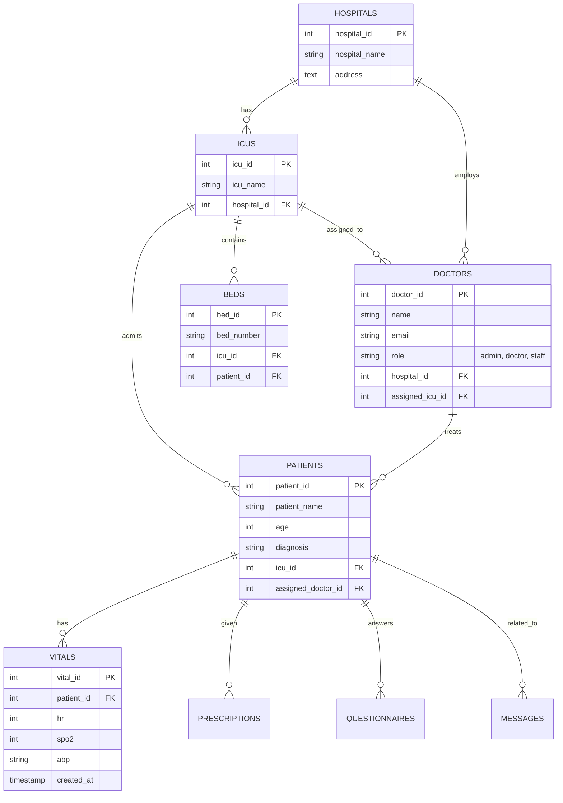

# Database Schema

## Overview
e-Vilochan uses a relational MySQL database named `vitalview` to store patient data, vital signs, user information, and messages.

## Entity-Relationship Diagram (ERD)

## Tables

### `hospitals`
Stores hospital information for multi-tenant support.
- **hospital_id** (PK): Unique identifier.
- **hospital_name**: Name of the hospital.

### `icus`
Intensive Care Units belonging to a hospital.
- **icu_id** (PK): Unique identifier.
- **icu_name**: Name of the ICU.
- **hospital_id** (FK): Reference to `hospitals`.

### `doctors` (Users)
Stores all users including Admins, Doctors, and Staff.
- **doctor_id** (PK): Unique identifier.
- **name**: Full name.
- **email**: Unique email address (used for login).
- **password**: Hashed password.
- **role**: Enum (`'admin'`, `'doctor'`, `'staff'`).
- **hospital_id** (FK): User's hospital.
- **assigned_icu_id** (FK): User's primary ICU (optional).

### `patients`
Current patient admissions.
- **patient_id** (PK): Unique identifier.
- **patient_name**: Full name.
- **diagnosis**: Medical diagnosis.
- **admission_date**: Date of admission.
- **icu_id** (FK): Current ICU location.
- **assigned_doctor_id** (FK): Primary physician.

### `beds`
Physical bed management.
- **bed_id** (PK): Unique identifier.
- **bed_number**: Label (e.g., "Bed 101").
- **patient_id** (FK): Currently occupied by (NULL if empty).

### `vitals`
Time-series data for vital signs.
- **vital_id** (PK): Unique identifier.
- **patient_id** (FK): Reference to `patients`.
- **hr**: Heart Rate (bpm).
- **spo2**: Oxygen Saturation (%).
- **abp**: Arterial Blood Pressure (sys/dia).
- **source**: Data source ('camera', 'video', 'manual').
- **additional_data**: JSON field for extra parameters.

### `messages`
Chat history for real-time communication.
- **message_id** (PK): Unique identifier.
- **sender_id** (FK): Reference to `doctors`.
- **content**: Text content.
- **image_url**: Base64 or URL of image (if any).
- **hospital_id** / **icu_id** / **patient_id**: For scoping the chat room.

### `prescriptions`
Medication orders.
- **prescription_id** (PK): Unique identifier.
- **patient_id** (FK): Reference to `patients`.
- **medication_name**: Name of drug.
- **dosage**: e.g., "500mg".
- **frequency**: e.g., "BID".
